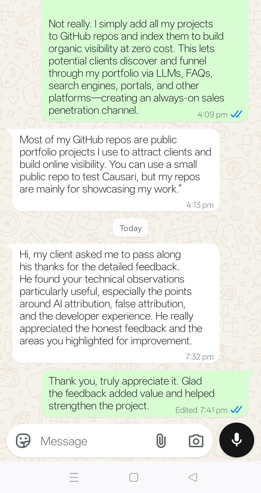
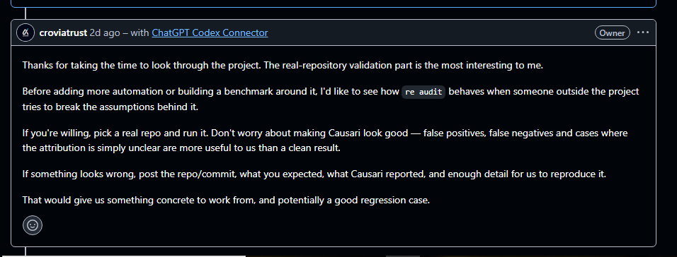

<div align="center">
  
</div>

<div align="center">
  <a href="https://desidevloper.com" target="_blank">
    
  </a>
</div>

---

<div align="center">

## 🎯 **I Collab What's Costing You Time **
### *From Prompt to Production • Without 6 Weeks and a Project Manager*

**Specialized in:**  
🇮🇳 Indian SMBs & Startups • Uplifting Sick Units to Profitable stage  • 🏢 Housing Societies • 🛒 E-Commerce • 🤖 AI Workflows • 📊 Business Intelligence

</div>

---

<div align="center">

### 📱 **Connect With Me**

[](https://desidevloper.com)
[](https://wa.me/919727413309?text=Hi%20SNTL84%2C%20I%20want%20to%20discuss%20a%20project)

[](https://www.linkedin.com/in/sntl2784)
[](mailto:3goldenlotusroots@gmail.com)

[](https://www.instagram.com/desibiztrade)
[](https://aratt.ai/user/@desidevloper)

</div>

---

<div align="center">

### ⚡ **Quick Action**

**[🚀 Book Free 20-Min Strategy Call](https://wa.me/919727413309?text=Hi%20SNTL84%2C%20I%20want%20a%20free%20strategy%20call)** • **[📂 Explore All Projects](#featured-work)** • **[💼 View Full Services](#what-i-deliver)**

</div>

---

## 🏅 **OSS Contributor & Maintainer Achievements**

> *Merged PRs, bug fixes, triage contributions, and embed-react specialist work in production open-source projects.*

<div align="center">

| Achievement | Level | Details |
|-------------|-------|---------|
| 🟢 **OSS Contributor** | ✅ Active | Merged PR into [ishandutta2007/Velocity](https://github.com/ishandutta2007/Velocity) |
| 🛠️ **Bug Fix Contributor** | ✅ Shipped | Fixed critical `ERR_MODULE_NOT_FOUND` build crash (PR [#25](https://github.com/ishandutta2007/Velocity/pull/25)) |
| 🧪 **Test Suite Author** | ✅ Shipped | Authored `ArtifactStore` regression test suite (167 additions) |
| 🔍 **Triage Contributor** | ✅ Active | Diagnosed root cause of Issue [#17](https://github.com/ishandutta2007/Velocity/issues/17) — empty `src/artifacts/` directory |
| 🧩 **Maintainer-Level Review** | 🟡 Rising | Structured PR body with root cause analysis, test matrix, CI safety notes |
| 🌍 **Cross-Repo Contributor** | ✅ Unlocked | Contributed to upstream repo outside personal GitHub org |
| ⚛️ **@calcom/embed-react Specialist** | 🔥 Active | Root cause analysis + 3-tier fix for [cal.com #28979](https://github.com/calcom/cal.com/issues/28979) — `useRef` guard short-circuit bug affecting all React embed users |

</div>

---

## 🧭 **Strategic Project Feedback Support**

> **Available on request:** I provide independent, practical technical feedback on real software projects — especially where AI attribution, false attribution, validation logic, developer experience, reproducibility, and workflow assumptions need an outside perspective.

### 📸 **Proof of Contribution — Real Client & Project Feedback**

<div align="center">

#### 1. Causari — Owner Appreciation for Technical Feedback


<br/>

*Client (via intermediary): “He found your technical observations particularly useful, especially the points around AI attribution, false attribution, and the developer experience. He really appreciated the honest feedback and the areas you highlighted for improvement.”*

<br/><br/>

#### 2. cal.com / embed-react & Real-Repo Validation Request


<br/>

*Project owner (croviatrust): “The real-repository validation part is the most interesting to me… If something looks wrong, post the repo/commit, what you expected, what Causari reported, and enough detail for us to reproduce it.”*

</div>

### **How I Support Projects**

| Support Area | What I Add |
|--------------|------------|
| 🔍 **External Validation** | Test a real repository from outside the project context and challenge assumptions |
| 🤖 **AI Attribution Review** | Flag weak, unclear, false-positive, or false-negative attribution patterns |
| 🧪 **Reproducibility Feedback** | Document repo/commit, expected behaviour, observed result, and useful regression cases |
| 👨‍💻 **Developer Experience Review** | Surface friction, unclear flows, and practical improvements from a fresh user perspective |
| 🎯 **Strategic Feedback** | Focus on what is useful to the product rather than simply making results look clean |

**Reference:** [Causari — GitHub Issue #60](https://github.com/croviatrust/causari/issues/60)  
*Feedback was reviewed by the project owner and specifically appreciated for its technical observations around AI attribution, false attribution, and developer experience.*

---

## ⚛️ **@calcom/embed-react — Active Contribution**

> *Actively triaging and fixing issues in [`@calcom/embed-react`](https://github.com/calcom/cal.com/tree/main/packages/embed-react) — the React embed package used by thousands of cal.com users.*

<div align="center">

| Issue | Root Cause | My Fix | Status |
|-------|-----------|--------|--------|
| [#28979](https://github.com/calcom/cal.com/issues/28979) — `config` prop ignored after mount | `useRef` guard `c.current` short-circuits effect re-runs despite `config` being in dep array | Split init/update into 2 effects; reactive config update via embed UI API | 🔥 PR in progress |

**Specialty:** React hooks lifecycle • embed package architecture • `useRef` footguns • effect dependency optimization

</div>

### 🔧 The Fix (Option 1 — Recommended)

```tsx
// Effect 1: One-time initialization — guard is correct here
useEffect(() => {
  if (!a || c.current || !f.current) return;
  c.current = true;
  a.ns[t]("inline", { config: o });
}, [a, e, t, l, n]); // config intentionally excluded — init-only

// Effect 2: Reactive config updates — no guard, runs on every config change
useEffect(() => {
  if (!c.current || !a) return; // only after init
  a.ns[t]("ui", o); // update embed theme/config without remount
}, [o]); // only config triggers this
```

> 💡 **Impact:** Fixes silent theme/config update failures for all `<Cal />` inline embed users on React 18+. No iframe remount. No UX flash.

---

### 🏆 **GitHub Badges Earnable (Simultaneously)**

<div align="center">

| Badge | How to Earn | Status |
|-------|------------|--------|
| 🦈 **Pull Shark** | Get 2+ PRs merged in public repos | 🟡 1 merged — cal.com PR = unlock! |
| ⚡ **Quickdraw** | Close issue or PR within 5 min of opening | ✅ Eligible — act fast on next one |
| 🌟 **Starstruck** | Repo receives 16+ stars | 🟡 Star [Velocity](https://github.com/ishandutta2007/Velocity) & share |
| 🧠 **Galaxy Brain** | Answer accepted as solution in Discussions | 🟡 Join Velocity Discussions |
| 🏅 **YOLO** | Merge your own PR without review | ✅ Eligible on your personal repos |
| ❤️ **Pair Extraordinaire** | Co-author a merged commit | 🟡 Add co-author on next PR |

</div>

> 💡 **Next milestone:** Merge **cal.com embed-react PR** → unlocks **Pull Shark** badge + establishes embed-react specialty on profile.

---

## 🚀 **Leveled-Up Skills — June 2026**

<div align="center">

| Skill | Previous Level | Upgraded To | Evidence |
|-------|---------------|-------------|----------|
| 🧪 **Unit Testing (Node.js/ESM)** | Intermediate | **Advanced** | ArtifactStore test suite — mocked DB + FS, in-memory CI |
| 🔍 **Root Cause Analysis** | Intermediate | **Advanced** | Diagnosed ESM module resolution failure in TypeScript monorepo |
| 🛠️ **Open Source Contribution** | Beginner | **Contributor** | Merged PR into production OSS AI agent framework |
| 🤖 **AI Agent Architecture** | Familiar | **Hands-On** | Worked inside Velocity — OSS equivalent of Cursor/Claude Code |
| 📋 **Triage & Issue Analysis** | Basic | **Maintainer-Level** | Structured root cause + fix matrix in PR description |
| 🏗️ **TypeScript Monorepo** | Familiar | **Contributor** | Navigated `newcore/` ESM module graph in real project |
| ⚛️ **React Hooks / Embed Architecture** | Advanced | **Specialist** | `useRef` guard footgun analysis in cal.com embed-react package |

</div>

---

## 🗣️ **Client & Maintainer Feedback — Proof of Contribution**

[#-client--maintainer-feedback--proof-of-contribution](#-client--maintainer-feedback--proof-of-contribution)
> *Public GitHub repos are my always-on sales channel. Project owners find them, ask for an independent review, and act on it. Real screenshots, unedited.*

<table>
  <tr>
    <td align="center" width="50%">
      <a href="assets/testimonial-causari-whatsapp-feedback.jpg">
        
      </a>
      <br><br>
      <b>📱 Causari — Client Feedback (WhatsApp)</b><br>
      <sub>The project owner passed on thanks for the <i>detailed technical review</i> — specifically the points on <b>AI attribution, false attribution and developer experience</b> — and the honest improvement areas I flagged.</sub>
    </td>
    <td align="center" width="50%">
      <a href="assets/testimonial-crovia-github-feedback.png">
        
      </a>
      <br><br>
      <b>🐙 Crovia / Causari — Owner Comment (GitHub)</b><br>
      <sub>The project owner engaged with my review, called the real-repo validation the most interesting part, and invited me to stress-test <code>re audit</code> and report failures as regression cases.</sub>
    </td>
  </tr>
</table>

<p align="center"><i>Click any screenshot to view full size.</i></p>

**What this shows:** strategic, unpaid external project reviews → inbound replies from maintainers → real follow-up work. **Have a project that needs honest technical feedback?** [**💬 Message me on WhatsApp →**](https://wa.me/919727413309?text=Hi%20SNTL84%2C%20I%20want%20feedback%20on%20my%20project)

---

## 👤 **Who I Help**

> **Founders, agency owners, and SMB operators** in India and globally who are losing **hours every week to manual work** — hiring, lead generation, operations, reporting — and need someone who builds **production-ready systems fast**.

### **If This Is You:**
- ✅ Team copy-pasting data between tools
- ✅ Screening resumes by hand (taking 4+ hours/day)
- ✅ Managing housing society operations with paper forms
- ✅ Running e-commerce manually across multiple platforms
- ✅ Paying people to do repetitive tasks

**→ You're in the right place.**

---

## 🎁 **What I Deliver**

<table align="center">
<tr>
<th>🎯 What You Get</th>
<th>📊 The Impact</th>
<th>⏱️ Timeline</th>
</tr>
<tr>
<td><strong>🤖 AI Hiring System</strong><br/>Auto-score resumes, generate shortlists</td>
<td><strong>80% faster</strong> resume processing<br/>4 hrs → 45 min/day</td>
<td>3–5 days</td>
</tr>
<tr>
<td><strong>🚀 Lead Enrichment Agent</strong><br/>Auto-enrich B2B leads with founder data</td>
<td><strong>93% faster</strong> research<br/>45 min → 3 min per lead</td>
<td>2–4 days</td>
</tr>
<tr>
<td><strong>🏢 Backoffice OS</strong><br/>Attendance, payroll, petty cash, field visits</td>
<td><strong>6 hrs/week saved</strong><br/>3 spreadsheets → 1 dashboard</td>
<td>5–7 days</td>
</tr>
<tr>
<td><strong>🏙️ MetroMate Suite</strong><br/>Parking management, vehicle registration</td>
<td><strong>100% paperless</strong> operations<br/>Trilingual • WhatsApp-native</td>
<td>2–3 days</td>
</tr>
<tr>
<td><strong>🛒 E-Commerce Automation</strong><br/>Multi-platform order & inventory sync</td>
<td><strong>100% accuracy</strong> across channels<br/>Eliminate overselling</td>
<td>3–7 days</td>
</tr>
<tr>
<td><strong>⚙️ AI Workflow Automation</strong><br/>n8n • Zapier • Custom pipelines</td>
<td><strong>Any repetitive task</strong> Collabd<br/>24/7 no-code operations</td>
<td>3–7 days</td>
</tr>
</table>

---

## 💼 **Featured Work**

### 🏆 **Flagship Projects** *(Live, Revenue-Generating)*

<div align="center">

#### 🏙️ **MetroMate — Residential Parking Management OS**
[**→ Repository**](https://github.com/SNTL84/MetroMate) • [**→ Brand Development**](https://github.com/SNTL84/metromate-shiv-kathiawadi-thali-brand-development) • [**→ Live Demo**](https://github.com/SNTL84/sntl84-desidevloper-live-demo)

**Collabd parking management for housing societies. Zero paper. Three languages. WhatsApp-native.**

| Challenge | MetroMate Solution |
|-----------|-------------------|
| 📄 Paper forms lost in letterboxes | ✅ Digital WhatsApp submission (instant) |
| ❓ Unknown vehicle ownership | ✅ Master register with auto-verification |
| 🌐 English-only forms → No participation | ✅ English + Gujarati + Hindi |
| 🔢 Manual parking calculations | ✅ Live deficit/surplus auto-calculated |
| ⚠️ No audit trail | ✅ Complete compliance dashboard |

**Real Result:** 42 flats • 100% digital • Zero paper • Managing 200+ vehicles

---

#### 🤖 **AI Hiring Intelligence System**
[**→ Main Project**](https://github.com/SNTL84/sntl84-ai-hiring-intel) • [**→ Agentic Recruiter**](https://github.com/SNTL84/sntl84-agentic-recruiter) • [**→ Smart Job Board**](https://github.com/SNTL84/sntl84-hiring-system)

**AI-powered resume screening that catches the best candidates instantly.**

| Old Way (Manual) | New Way (AI) |
|------------------|--------------|
| Screen 100 CVs: **4 hours** | Screen 100 CVs: **2 minutes** |
| Score 1 resume: **15 minutes** | Score 1 resume: **5 seconds** |
| Miss 30% of good candidates | **Zero false negatives** |
| Hiring cost: **₹500k/quarter** | Hiring cost: **₹200k/quarter** *(60% reduction)* |

**Auto-scores | Generates shortlists | LinkedIn enrichment | Bulk operations**

---

#### 🏢 **Backoffice OS — HR & Operations Dashboard**
[**→ Repository**](https://github.com/SNTL84/sntl84-backoffice-os)

**Single dashboard for attendance, payroll, petty cash, field visits, and expense tracking.**

**Real Result:** Replaced 3 spreadsheets → 1 unified system → **6+ hours/week saved** in admin overhead

#### 🌐 **Velocity — AI Agent Framework (OSS Contributor)**
[**→ Upstream Repo**](https://github.com/ishandutta2007/Velocity) • [**→ My Merged PR #25**](https://github.com/ishandutta2007/Velocity/pull/25)

**Contributed to Velocity — the open-source equivalent of Google Antigravity / Cursor / Claude Code.**

| My Contribution | Details |
|-----------------|---------|
| 🐛 **Bug Fixed** | `ERR_MODULE_NOT_FOUND` crash on `src/artifacts/index.js` |
| 🧪 **Tests Added** | 6-case `ArtifactStore` regression suite — fully mocked, CI-safe |
| 🔍 **Root Cause** | Empty `src/artifacts/` directory broke Node ESM resolution at startup |
| 📋 **PR** | [#25](https://github.com/ishandutta2007/Velocity/pull/25) — 167 additions, 1 file, merged ✅ |

#### ⚛️ **cal.com — embed-react Bug Fix (OSS — PR In Progress)**
[**→ Issue #28979**](https://github.com/calcom/cal.com/issues/28979) • [**→ Fork**](https://github.com/SNTL84/cal.com)

**Fixing a high-impact silent failure in `@calcom/embed-react` v1.5.3 affecting all React inline embed users.**

| My Contribution | Details |
|-----------------|---------|
| 🔍 **Root Cause** | `useRef` guard `c.current` short-circuits effect re-runs despite `config` in dep array |
| 🛠️ **Fix Strategy** | Split initialization + reactive config update into 2 separate `useEffect` hooks |
| 🧪 **Tests** | Double-init prevention test + reactive theme update test |
| 📋 **Impact** | Affects all `<Cal />` inline embed users switching themes/config dynamically |
| 🌍 **Scope** | `packages/embed-react/src/Cal.tsx` + dist rebuild |

</div>

---

### 🚀 **AI & Automation Agents**

<table align="center">
<tr>
<th width="35%">Agent</th>
<th width="50%">What It Does</th>
<th width="15%">Repo</th>
</tr>
<tr>
<td><strong>🎯 Lead Enrichment Agent</strong></td>
<td>Auto-enrich B2B leads with founder names, funding stage, LinkedIn profiles → Export as VCF</td>
<td><a href="https://github.com/SNTL84/ai-lead-enrichment-agent">→ Go</a></td>
</tr>
<tr>
<td><strong>🧠 FMCG Lead Intelligence</strong></td>
<td>n8n + Claude AI pipeline: Scrape → Score → Draft WhatsApp/Email → Send automatically</td>
<td><a href="https://github.com/SNTL84/sntl84-fmcg-lead-intel">→ Go</a></td>
</tr>
<tr>
<td><strong>📊 Business Intelligence Push</strong></td>
<td>264 services across 22 industries categorized & published in 2 hours (vs. weeks of manual work)</td>
<td><a href="https://github.com/SNTL84/sntl84-business-intelligence-push">→ Go</a></td>
</tr>
</table>

---

### 🛒 **E-Commerce Automation Suite** *(7-Service Bundle)*

<div align="center">

**Complete workflow automation for Indian e-commerce sellers — Shopify, Flipkart, Amazon, Meesho**

</div>

| Service | What It Does | Platform | Repo |
|---------|--------------|----------|------|
| 📦 **Dropshipping Setup** | Supplier sourcing + store automation (₹0 inventory) | WooCommerce, Shopify | [→](https://github.com/SNTL84/sntl84-ecom-dropshipping-setup) |
| 🏪 **Marketplace Listing** | Amazon, Flipkart, Meesho listing management + A+ content | Multi-channel | [→](https://github.com/SNTL84/sntl84-ecom-marketplace-listing) |
| 🚚 **Order Fulfillment** | Shiprocket, Delhivery, BlueDart integration (end-to-end) | Logistics | [→](https://github.com/SNTL84/sntl84-ecom-order-fulfillment) |
| 💳 **Payment Integration** | Razorpay, Paytm, Stripe, UPI, COD support | All Gateways | [→](https://github.com/SNTL84/sntl84-ecom-payment-integration) |
| 🔄 **Inventory Sync** | Real-time stock sync across all channels (no overselling) | Multi-channel | [→](https://github.com/SNTL84/sntl84-ecom-inventory-sync) |
| 📣 **Ad Campaigns** | Google Ads, Meta, Instagram campaign management | Performance Marketing | [→](https://github.com/SNTL84/sntl84-ecom-ad-campaigns) |
| 🎧 **Customer Support** | WhatsApp bot, email, helpdesk + CRM integration | 24/7 Support | [→](https://github.com/SNTL84/sntl84-ecom-customer-support) |

---

### 🔧 **Automation Templates & Tools**

<div align="center">

| Tool | Purpose | Link |
|------|---------|------|
| 🤖 **n8n SMB Workflow Templates** | 50+ ready-to-import workflows (WhatsApp, GST, Razorpay, Shiprocket) | [⭐ Star It](https://github.com/SNTL84/n8n-india-smb-workflow-templates) |
| 📞 **WhatsApp Outreach Tool** | Bulk WhatsApp messaging + VCF export + instant WA links | [Go](https://github.com/SNTL84/whatsapp-outreach-tool) |
| ⚡ **DesiQuote** | Instant gig quote calculator (freelance pricing) | [Go](https://github.com/SNTL84/sntl84-desi-quote) |
| 🏠 **CoHost Virtual Assistant** | Airbnb property management landing page | [Go](https://github.com/SNTL84/sntl84-cohost-virtual-assistant-v3) |

</div>

---

### 💼 **Portfolio & Web Properties**

| Property | Tech Stack | Features | Link |
|----------|-----------|----------|------|
| 🌐 **DesiDeveloper Portfolio (Next.js)** | Next.js 14 • TypeScript • TailwindCSS • Framer Motion | AI-powered portfolio • Dark mode • Animations | [Repo](https://github.com/SNTL84/desidevloper-portfolio-nextjs) |
| 🔧 **DesiDeveloper (React)** | React • Vite • React Router • TailwindCSS | Full-stack portfolio • Trade directory | [Repo](https://github.com/SNTL84/desidevloper) |
| 📱 **Services Live Demo** | HTML • CSS • JavaScript | Complete services showcase | [Repo](https://github.com/SNTL84/sntl84-desidevloper-live-demo) |
| 📚 **Awesome AI Sales Agents** | Community Curated | 100+ AI SDR & sales automation tools | [⭐ Star It](https://github.com/SNTL84/awesome-ai-sales-agents) |

---

## 📊 **Real Results — Real Numbers**

> *Built for founders, SMBs, and operators. Every number below is from a real, production project.*

<div align="center">

| What I Built | Client Context | Result | Impact |
|--------------|-----------------|--------|--------|
| **AI Hiring System** | B2B recruitment | 4 hrs → 45 min/day | **80% faster** ⚡ |
| **Backoffice OS** | SMB operations | 3 spreadsheets → 1 dashboard | **6 hrs/week saved** 💰 |
| **Lead Enrichment Agent** | Startup outreach | 45 min → 3 min per lead | **93% faster** 🚀 |
| **MetroMate** | Housing society (42 flats) | Zero paper | **100% digital** |

</div>

---

<div align="center">

### 📊 GitHub Stats


</div>

---

# ❓ **SNTL84 Profile FAQ**

> **Have a business problem, technology requirement, automation idea, or software project? Start here.**

<details>
<summary><strong>01. Who is SNTL84?</strong></summary>

**SNTL84 is Milan** — an AI Workflow Developer, **Vibe Coder**, business-tech problem solver, and strategic project tester focused on turning business problems into practical digital solutions.

I work across **AI workflows, business automation, full-stack development, business intelligence, SME activation, restaurant technology, e-commerce enablement, technical configuration, technology sourcing, advertising technology, and real-world project validation**.

</details>

<details>
<summary><strong>02. What does SNTL84 actually do?</strong></summary>

I help businesses move from **problem → practical solution → working setup**.

Typical work includes:

- 🤖 AI & agentic workflows
- ⚙️ Business process automation
- 💻 Full-stack web development
- 🧑‍💻 Vibe coding and rapid prototyping
- 📊 Business intelligence and dashboards
- 🏢 SME digital activation
- 🍽️ Restaurant technology setup
- 🛒 E-commerce business setup
- 📣 Meta Ads Manager configuration
- 🔧 Business technology configuration
- 🧪 Strategic testing and external validation
- 🔌 API, portal, SaaS and tool integrations
- 💰 Cost-effective technology sourcing

</details>

<details>
<summary><strong>03. What business problems can I bring to SNTL84?</strong></summary>

You can approach me when your business needs **activation, setup, configuration, automation, technology sourcing, digital marketing infrastructure, or custom software**.

### 🏢 SME Activation & Digital Business Setup

- SME digital activation and technology setup
- Website / landing-page setup
- Google Business Profile configuration
- WhatsApp Business setup
- Business listings and lead capture
- CRM setup and configuration
- Basic analytics and reporting
- Workflow mapping and business process automation

**Goal:** get the business digitally operational quickly without unnecessary technology spending.

### 🍽️ Restaurant & Food Business Setup

For restaurants, cafés, cloud kitchens, caterers and food businesses:

- Restaurant website / landing page
- Menu digitization
- Google Business Profile
- WhatsApp Business
- **Zomato configuration**
- **Swiggy configuration**
- Food-delivery portal configuration
- Online-ordering workflows
- Customer enquiry / booking flows
- Instagram & Facebook business setup
- Restaurant promotion setup
- Meta Ads configuration
- Campaign tracking and analytics

**Goal:** make the restaurant **discoverable, order-ready, promotion-ready and digitally manageable**.

### 🛒 E-Commerce Business Setup

- Shopify / WooCommerce setup
- Product catalogue configuration
- Marketplace setup and workflow support
- Amazon / Flipkart / Meesho support
- Payment gateway configuration
- UPI / COD setup
- Inventory configuration
- Order-management workflows
- Shipping / fulfillment integrations
- WhatsApp customer communication
- Analytics and reporting
- Meta Ads setup
- Product-promotion workflows
- Cross-platform automation

**Business flow:** Product → Store → Payment → Order → Fulfillment → Customer → Analytics.

### 💻 Technology Configuration for Your Business

Sometimes you don't need new software. You need your existing technology **configured properly**.

I can help review and configure:

- Domains & hosting
- Business email
- Google Workspace
- Google Business Profile
- WhatsApp Business
- Websites
- CRM systems
- Payment gateways
- Analytics
- Meta Business Suite
- Meta Ads Manager
- Facebook Pages
- Instagram Business
- E-commerce platforms
- Delivery portals
- APIs and integrations
- Automation platforms
- Dashboards and reporting

### 💰 Tech Sourcing for Quick, Cost-Effective Setup

I can help identify technology that is **practical, affordable and fast to deploy**:

- SaaS / tool comparison
- Hosting and domain selection
- Business software selection
- Hardware / technology requirement planning
- Website technology selection
- Automation-tool selection
- API / integration options
- Low-cost MVP architecture
- Free / low-cost alternatives where appropriate
- Upgrade paths for future scaling

**Principle:** don't buy enterprise technology for an SME problem.

### 📣 Meta Ads Manager & Advertising Configuration

I can help configure:

- Meta Business Portfolio / Business Manager
- Facebook Page connection
- Instagram account connection
- Ad account setup
- **Meta Ads Manager configuration**
- Meta Pixel planning/configuration
- Conversions API planning/configuration
- Domain verification
- Events configuration
- Conversion tracking
- Lead campaigns
- WhatsApp campaigns
- Traffic campaigns
- Engagement campaigns
- Retargeting setup
- Audience configuration
- Campaign structure
- Performance tracking

**Business flow:** Business → Page → Instagram → Ad Account → Tracking → Audience → Campaign → Lead / Conversion → Measurement.

### 👨‍💻 Vibe Coding + Full-Stack Development Team

I work as a **Vibe Coder** for rapid discovery, prototyping and iteration, supported by a **team of full-stack developers** for larger or production-oriented requirements.

Depending on the requirement, we can build:

- Websites
- Web applications
- Dashboards
- Business portals
- SaaS MVPs
- AI-powered applications
- Internal business systems
- APIs
- Database-backed applications
- Automation systems
- E-commerce platforms
- Custom integrations

**Vibe coding provides speed. Engineering discipline is applied where reliability, security, scalability and maintainability matter.**

### 🤖 AI & Automation

I can identify repetitive work that may be automated through **AI workflows, AI agents, n8n, APIs, WhatsApp workflows, lead enrichment, data processing, automated reporting, customer-support workflows, sales follow-ups, business intelligence and internal dashboards**.

### 🔧 The Bigger Question

You don't need to know whether you need a **Website • App • AI • Automation • Meta Ads • Zomato • Swiggy • E-commerce • CRM • Dashboard • API • Software • or simply better configuration**.

Bring the **business problem**.

**Cost → Speed → Business Value → Scalability → Ease of Use**

</details>

<details>
<summary><strong>04. What does “I Collab What's Costing You Time” mean?</strong></summary>

I start with the **business problem**, not the technology.

> **What is currently costing you the most time, money or operational effort?**

Then I look for the smallest practical solution that removes the bottleneck.

</details>

<details>
<summary><strong>05. Who should approach SNTL84?</strong></summary>

Founders, startups, **SMEs, restaurant owners, e-commerce sellers, agencies, sales leaders, operations teams, product builders, SaaS founders, developers and open-source maintainers** can approach me.

You do not need a technical background.

**If you can explain the problem, we can explore the solution.**

</details>

<details>
<summary><strong>06. Does SNTL84 only build websites?</strong></summary>

**No.** Web development is one part of the work. The broader focus is:

**Problem → Workflow → Technology → Automation → Interface → Validation → Deployment**

Sometimes the answer is a website. Sometimes it is a dashboard, AI agent, automation, portal configuration, advertising setup, or better use of tools the business already owns.

</details>

<details>
<summary><strong>07. What makes SNTL84 different from a conventional developer?</strong></summary>

I combine **business-side operational thinking with technical implementation**.

I look at users, operations, cost, adoption, repetitive work, failure points, workflow dependencies and business practicality — not only code and frameworks.

**The objective is to make the business work better, not simply to build more software.**

</details>

<details>
<summary><strong>08. Can SNTL84 work with an existing project?</strong></summary>

**Yes.** Existing GitHub repositories, React / Next.js projects, TypeScript projects, n8n workflows, AI workflows, SaaS prototypes, open-source projects, business dashboards, e-commerce systems and existing portals can all be reviewed, configured, improved or extended.

</details>

<details>
<summary><strong>09. Does SNTL84 provide independent technical feedback?</strong></summary>

**Yes.** I provide practical external feedback around false positives, false negatives, AI attribution, reproducibility, UX friction, developer experience, workflow assumptions, validation weaknesses, edge cases and regression opportunities.

</details>

<details>
<summary><strong>10. Can I ask SNTL84 to test my GitHub repository?</strong></summary>

**Yes.** Share the repository URL, branch or commit, expected behaviour, observed behaviour, what you want validated and any known edge cases.

The strongest feedback is **specific, reproducible and evidence-based**.

</details>

<details>
<summary><strong>11. Does SNTL84 contribute to open source?</strong></summary>

**Yes.** The profile documents open-source contribution, issue analysis, root-cause analysis, regression testing and React embed work involving projects such as **Velocity** and **cal.com / @calcom/embed-react**.

</details>

<details>
<summary><strong>12. What technical areas does SNTL84 work with?</strong></summary>

Practical areas include **React, Next.js, TypeScript, JavaScript, Python, Node.js, Tailwind CSS, REST APIs, GitHub, n8n, AI APIs, automation workflows, WhatsApp workflows, dashboards, e-commerce integrations and cloud deployment**.

Technology is selected according to the business requirement.

</details>

<details>
<summary><strong>13. Can SNTL84 automate sales and lead generation?</strong></summary>

**Yes.**

**Discover → Enrich → Score → Segment → Draft → Approve → Send → Track**

This can support B2B prospecting, lead qualification, distributor discovery, outreach preparation, follow-ups and reporting.

</details>

<details>
<summary><strong>14. Can SNTL84 help restaurants and food businesses get digitally ready?</strong></summary>

**Yes.** A restaurant can approach me for a connected setup covering:

**Google Business → Website → WhatsApp → Zomato → Swiggy → Instagram → Facebook → Meta Ads → Tracking**

The exact scope depends on the restaurant's existing accounts, portals, requirements and budget.

</details>

<details>
<summary><strong>15. Can SNTL84 help with e-commerce from zero?</strong></summary>

**Yes.**

**Business model → Store → Catalogue → Payments → Shipping → Marketplace → Customer support → Analytics → Advertising → Automation**

The aim is to launch a practical system first and scale it as the business validates demand.

</details>

<details>
<summary><strong>16. Can SNTL84 help businesses choose technology before they spend money?</strong></summary>

**Yes.** I can help compare tools, platforms, hosting, software, automation products and integration options using **required capability + setup speed + cost + reliability + future scalability**.

</details>

<details>
<summary><strong>17. Can SNTL84 configure Meta Ads Manager?</strong></summary>

**Yes.** Support can include Meta Business Portfolio, Facebook / Instagram connections, ad account, **Meta Ads Manager**, Pixel, conversion events, Conversions API planning, audiences, campaign structure, lead / WhatsApp campaigns, retargeting and performance tracking.

The goal is a **properly connected advertising system**, not simply publishing ads.

</details>

<details>
<summary><strong>18. Can SNTL84 help businesses with technology they already own?</strong></summary>

**Yes.**

**What you already have → What is configured → What is missing → What should be connected → What can be automated**

This can often be more cost-effective than replacing everything.

</details>

<details>
<summary><strong>19. Can SNTL84 work with limited SME budgets?</strong></summary>

**Yes.**

**Phase 1 → Solve the biggest bottleneck**  
**Phase 2 → Connect surrounding workflows**  
**Phase 3 → Add reporting and intelligence**  
**Phase 4 → Scale when justified**

</details>

<details>
<summary><strong>20. Does every project need AI?</strong></summary>

**No.** A form, database, dashboard, script, API, portal configuration or straightforward automation can be better than AI.

**AI should solve a real problem — not become the problem.**

</details>

<details>
<summary><strong>21. Can SNTL84 help developers, founders and open-source maintainers?</strong></summary>

**Yes.** Collaboration can include issue triage, root-cause analysis, reproduction, regression testing, developer-experience feedback, real-repository testing, product feedback and workflow validation.

</details>

<details>
<summary><strong>22. What should I send when contacting SNTL84?</strong></summary>

Keep the first message simple:

**1. What are you building?**  
**2. What problem are you facing?**  
**3. What have you already tried?**  
**4. What outcome do you want?**  
**5. Website, repository, screenshot or demo link if available.**

That is enough to start.

</details>

<details>
<summary><strong>23. Do I need a complete project before contacting SNTL84?</strong></summary>

**No.** You can approach me at idea, prototype, MVP, existing-product, scaling, debugging, configuration or validation stage.

</details>

<details>
<summary><strong>24. Does SNTL84 work only with Indian businesses?</strong></summary>

**No.** I have strong practical exposure to Indian SME workflows, but the underlying capabilities can support projects globally.

</details>

<details>
<summary><strong>25. Is SNTL84 available for collaboration?</strong></summary>

**Yes.** I'm open to client projects, product collaborations, AI projects, automation projects, open-source collaboration, technical validation, strategic project feedback, agency partnerships and business-tech collaborations.

</details>

<details>
<summary><strong>26. What is the best reason to contact SNTL84?</strong></summary>

If you can clearly identify:

> **“This process is wasting our time, money or attention.”**

That is usually enough to start a conversation.

</details>

<details>
<summary><strong>27. Can I approach SNTL84 before committing to development?</strong></summary>

**Yes.** A repository, demo, screenshot, workflow diagram or short problem statement can be enough to start a practical discussion.

The objective is to determine the **right solution before unnecessary development or spending begins**.

</details>

<details>
<summary><strong>28. How do I contact SNTL84?</strong></summary>

**WhatsApp:** [💬 Start a Project Conversation](https://wa.me/919727413309?text=Hi%20SNTL84%2C%20I%20want%20to%20discuss%20a%20project)  
**Website:** [🌐 DesiDevloper](https://desidevloper.com)  
**LinkedIn:** [💼 @SNTL2784](https://www.linkedin.com/in/sntl2784)  
**Email:** [📧 3goldenlotusroots@gmail.com](mailto:3goldenlotusroots@gmail.com)  
**Instagram:** [📸 @desibiztrade](https://www.instagram.com/desibiztrade)

</details>

---

## 🤝 **Have a Problem Worth Solving?**

Don't send a perfect proposal.

Send the **problem**.

**Automation • AI • Software • E-commerce • Restaurant Technology • Meta Ads • Tech Configuration • Tech Sourcing • Testing • Business Process Improvement**

> ### **SNTL84 — I Collab What's Costing You Time.**
